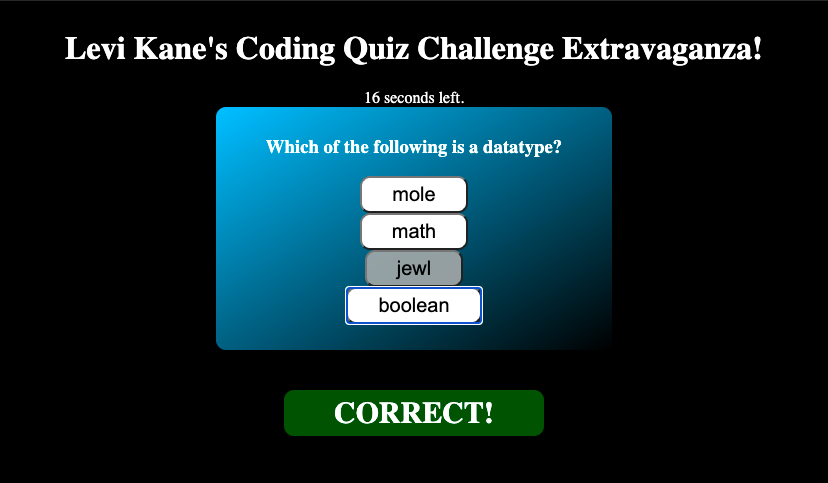

# codeQuiz

A timed quiz about coding built with JavaScript
All scores are saved using localStorage
A wrong answer will deduct 2 seconds from your timer!
A wrong answer will cost you 1 point!
Run out of time and the game will end.

